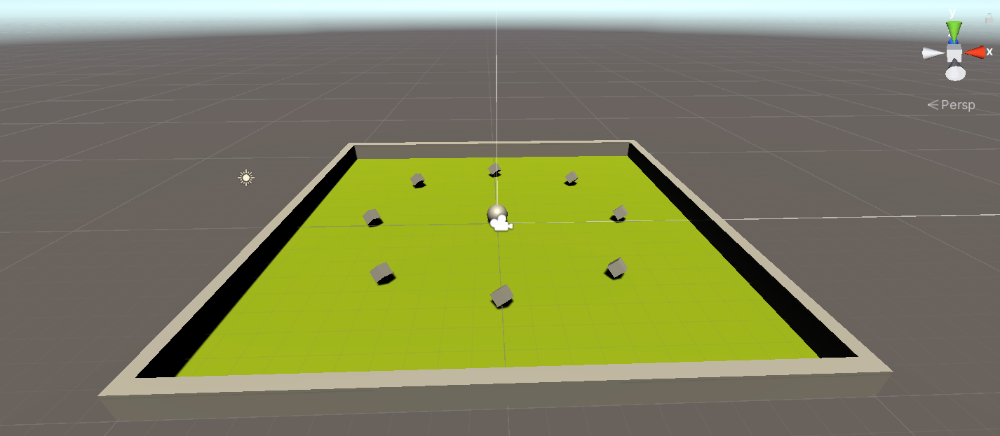
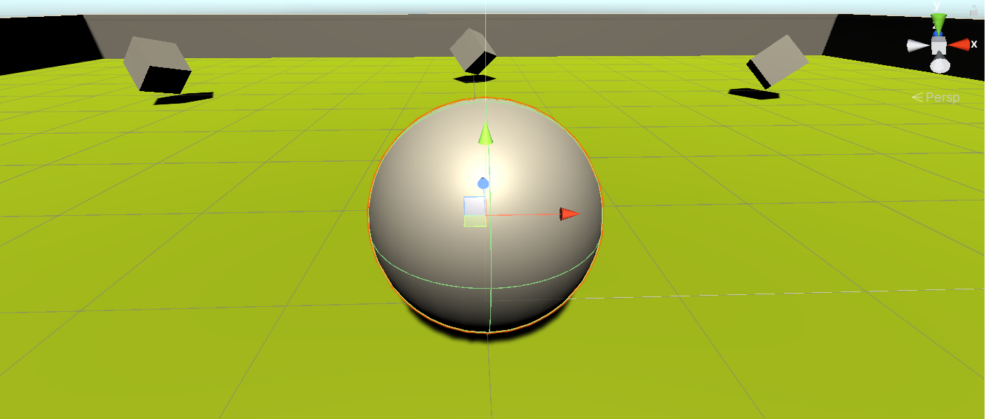
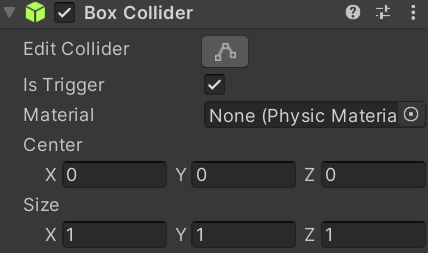
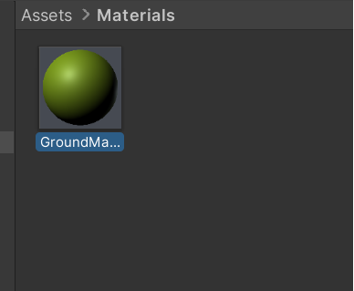
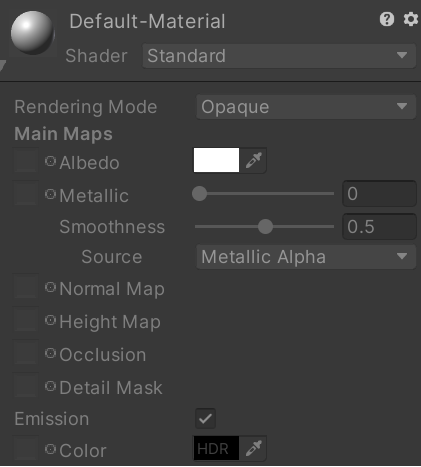
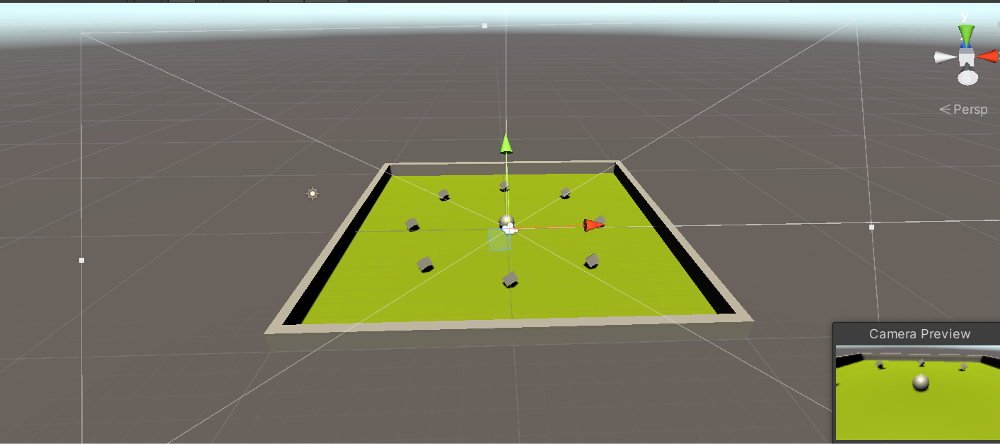
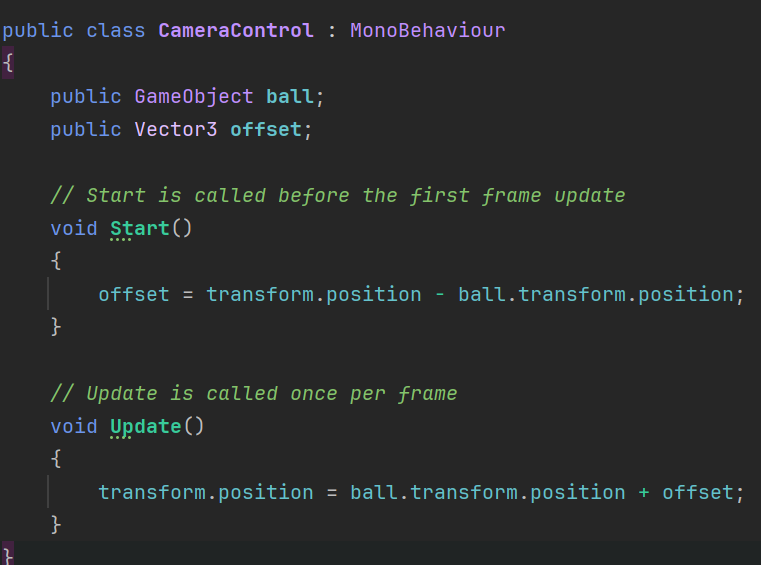
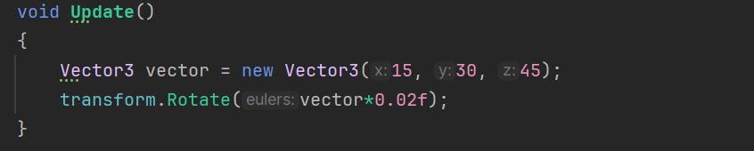
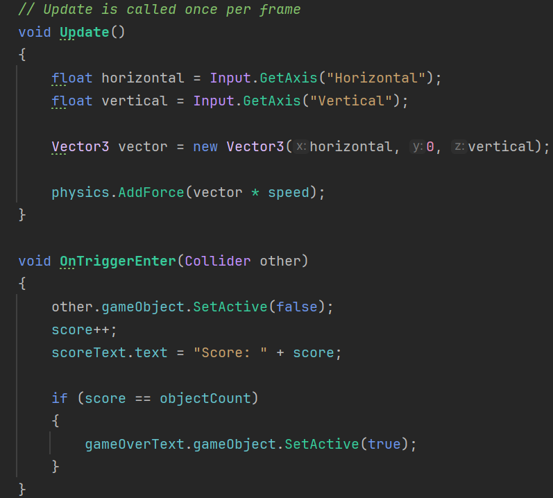
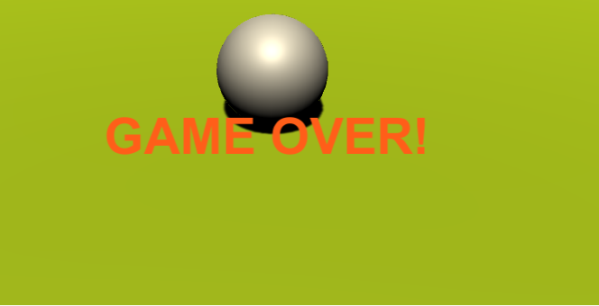

# Roll a Ball

## Created by Alexandru

# Main Explanation of the game

The main game consist from a player which in this case is a ball has to collect all the cubes from the ground and get the maximum score.

For now was decided that the ball will be a Rigidbody element which will collide with other elements in the game. When the ball touches the cube, box collider of the cubes are on trigger, because they will disappear all the time when the ball touches it.

 

##### Materials

Almost all the materials are by their default, it was decided that just the ground will have a specific color.

 

#### Camera

The camera was decided to be close to the ball, like in a 3rd person view. It was made for better user experience.

#### CameraController

### Main Mechanics

I multiplied the value of the movement by a particular positive number to make the ball go faster. I used the InputSystem package in Unity to take the inputs from a keyboard and transfer the movement onto the ball. To increase the visual appeal of the game, I rotated the collectables I created on the spot. I modified the PlayerScript file such that, upon collision between the ball with the cubes, they must disappear and increase the total score.

#### Rotator of the ball

In the picture below is shown how is made the movements of the ball and also how to make the cubes to disappear when is collided.

#### Game over

When all the cubes are collected a specific message on the screen will be shown.

