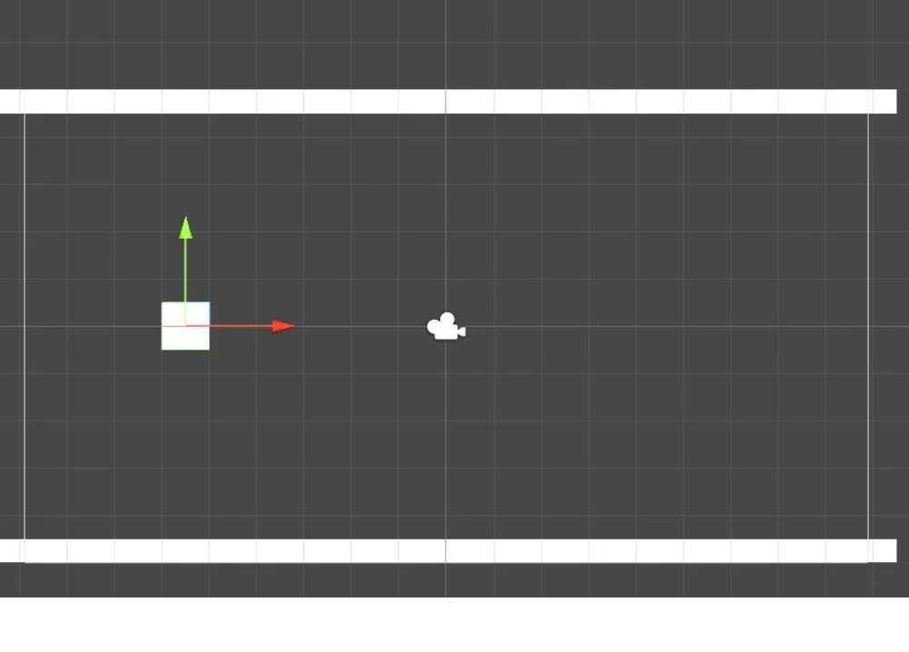
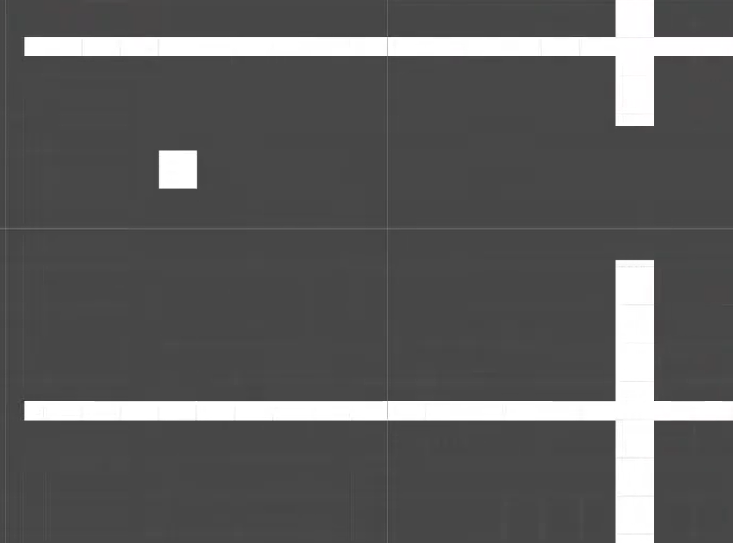
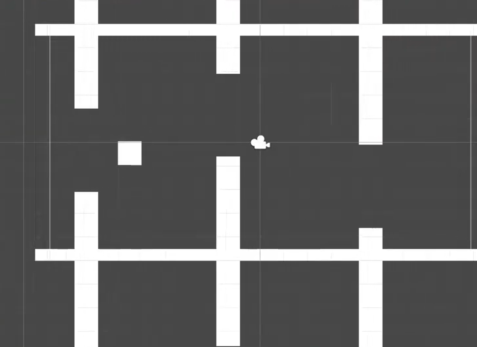
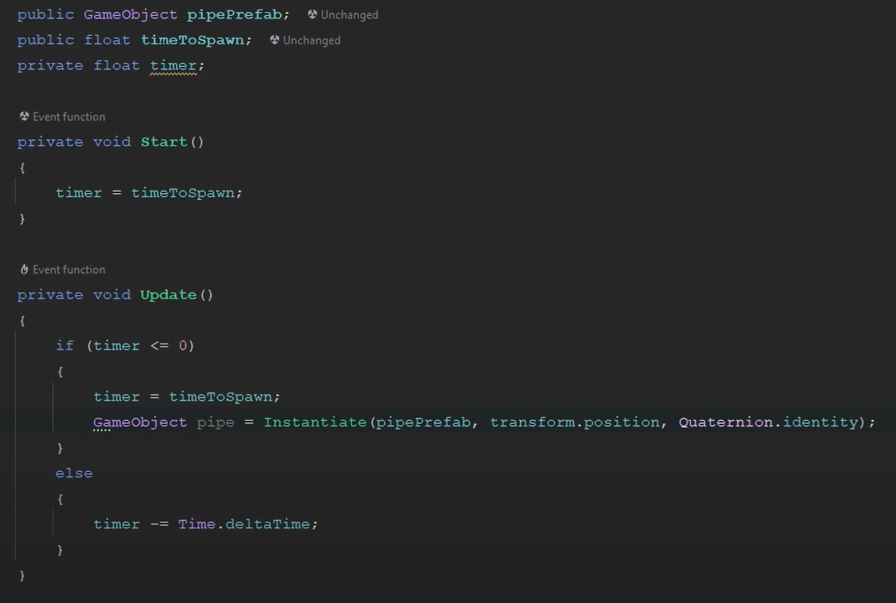
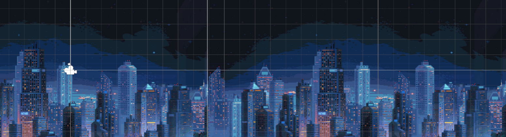
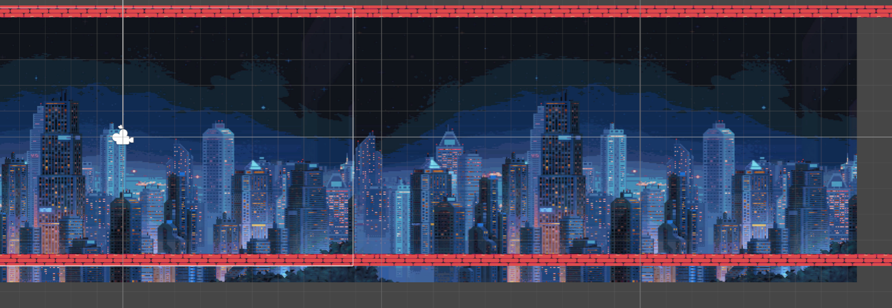

# Blog Post 3

## Introduction
In this blog post, I'll share the progress I've made so far on my 2D game project. This includes developing the player character, implementing core mechanics, and addressing various bugs that arose during the process.

## Overview
My game is a 2D platformer with simple graphics and physics-based gameplay. The game focuses on precise player control, obstacle interaction, and a dynamic environment.

## Feature Development

### Feature 1: Create the Main Player

#### Implementation:
I began by creating a simple square object to serve as the player character. Physics was added by implementing collision detection, allowing the player to interact with other objects in the game world. I also attached a rigid body to ensure the player behaves as a solid object. Additionally, I wrote a script that allows the player to jump when a key is pressed, and I created a basic animation for this action.

### Feature 2: Create the Floor and Sky

#### Implementation:
The floor and sky elements were created as simple rectangular shapes. Both have rigid body components and collision detection enabled, allowing the player to interact with them. This provides the basic environment for the gameplay.

### Feature 3: Create the Bars

#### Implementation:
I developed the bars, which serve as obstacles. These bars are simple vertical rectangles positioned in pairs, with a gap in between for the player to navigate through. Collision detection and rigid body components were applied to ensure they interact correctly with the player.

### Feature 4: Generating New Bars

#### Implementation:
To introduce a challenge, I created a script that spawns new bars every 2 seconds. These bars are initially placed off-screen, allowing the player some time to prepare before they enter the gameplay area.

### Code for bar spawner

### Feature 5: Move the Background and Add an Image

#### Implementation:
To create the illusion of movement, I doubled the background image and wrote a script that generates a new background as the previous one exits the screen. This ensures continuous background scrolling during gameplay.

#### Bug:
The background did not generate consistently, resulting in visible gaps and artifacts.

#### Solution:
I created a main file in the game directory to handle background management. I also corrected the x-axis values to ensure the background starts and ends at the appropriate positions. After experimenting with various methods, I found a reliable solution.

### Feature 6: Move the Floor and Sky and Add an Image

#### Implementation:
The same script and animation used for the background were applied to the floor and sky. This ensures that these elements move in sync with the background, creating a cohesive environment.

#### Bug:
The same generation inconsistency issue that affected the background also occurred with the floor and sky.

#### Solution:
The solution was identical to that of the background issue. By applying the same approach, the problem was resolved.

## Conclusion
Significant progress has been made in laying the foundation for my 2D game. The player character, basic environment, and core mechanics are now in place, along with solutions to initial bugs encountered during development. Moving forward, the focus will be on refining these elements, adding more complex gameplay features, and polishing the overall experience.
