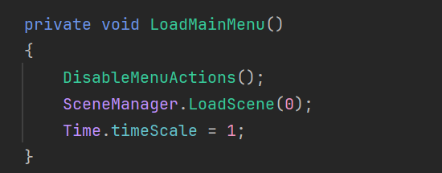

# Blog Post 4

## Introduction
In this blog post, I'll share the progress I've made on the user interface and game logic of my 2D game project. This includes displaying the score, implementing a death menu, and adding functional buttons for navigation.

## Overview
The focus of this development phase was to enhance the user experience by integrating a score display, a death menu with current and best scores, and buttons for navigating the game.

## Feature Development

### Feature 1: Create the Score Display During the Game

#### Implementation:
I added a TextMeshPro element to display the score during gameplay. A script was created to count the score, where each time the player successfully navigates between the bars, they earn 10 points. The space between the bars is an invisible collision zone, ensuring the player does not stop while earning points.

#### Score UI

### Feature 2: Create the Death Menu

#### Implementation:
I implemented a death menu that appears when the player hits a bar. Upon collision, the game scene pauses, and the death menu is displayed, allowing the player to either restart the game or return to the main menu.

### Feature 3: Display Current Score on Death Menu

#### Implementation:
For displaying the current score on the death menu, I reused the script developed in Feature 1, as it involves the same score calculation logic. This ensures consistency in how the score is tracked and displayed throughout the game.

### Feature 4: Display Best Score on Death Menu

#### Implementation:
I added a new TextMeshPro element to display the best score achieved by the player. This required modifications to the score script to track and update the highest score independently of the current score.

#### Bug:
The maximum score wasn't updating correctly, showing the same value as the current score.

#### Solution:
I corrected the logic in the script by adding a new method to properly track and compare the scores, ensuring that the best score updates only when a new high score is achieved.

### Feature 5: Add a Button to Return to the Main Menu

#### Implementation:
I created a new button in the death menu that redirects the player to the main menu. This was achieved by modifying the Game Manager script to load Scene 0 when the button is pressed. There were several bugs related to the UI hierarchy, but I resolved these issues by refining the structure and ensuring the button functionality was correctly linked.

### Feature 6: Add a Restart Button on Death Menu

#### Implementation:
A restart button was added to the death menu using a similar script to the one used for the main menu button. However, in this case, pressing the button reloads Scene 1, restarting the game so the player can try again.

## Conclusion
This phase of development focused on refining the user interface and ensuring a smooth player experience. With the score display, death menu, and navigation buttons fully implemented, the game is becoming more interactive and user-friendly. The next steps will involve further polishing these features and adding new gameplay elements to enhance the overall experience.

