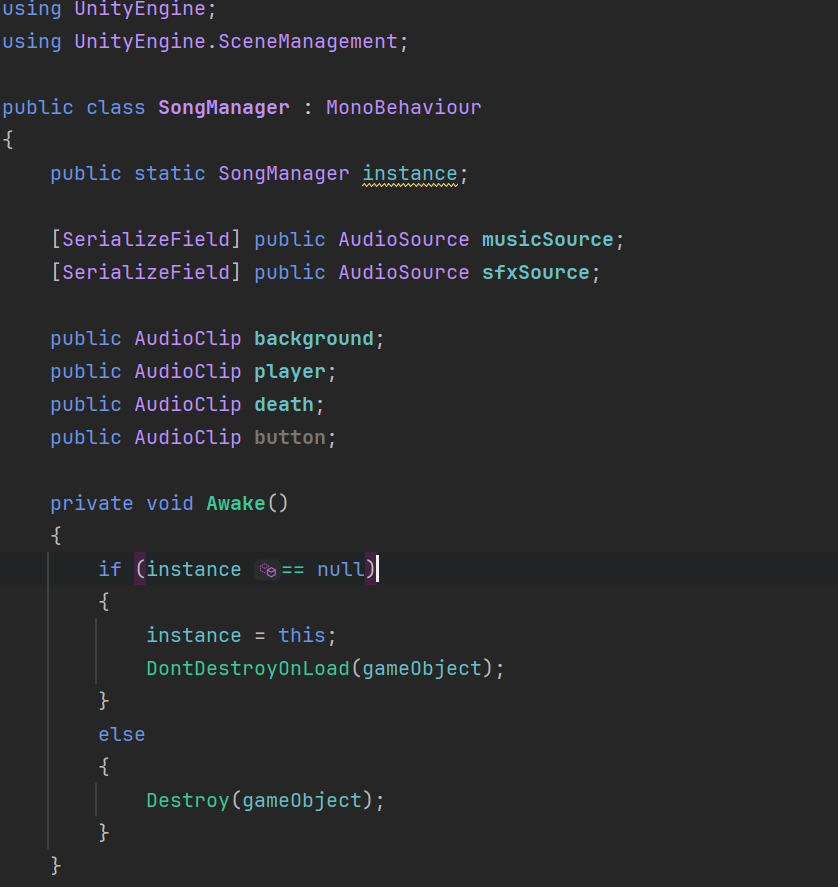
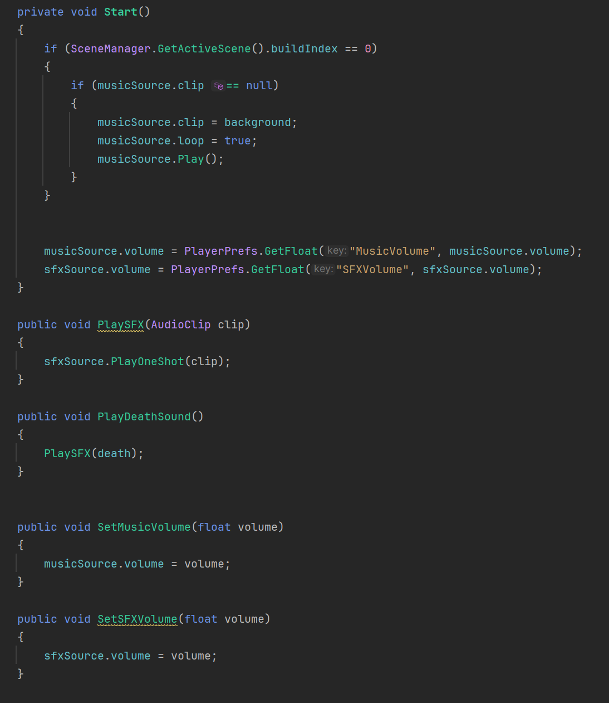
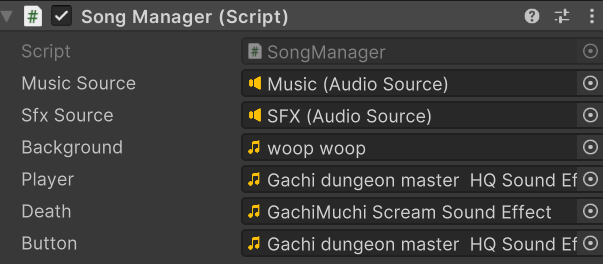
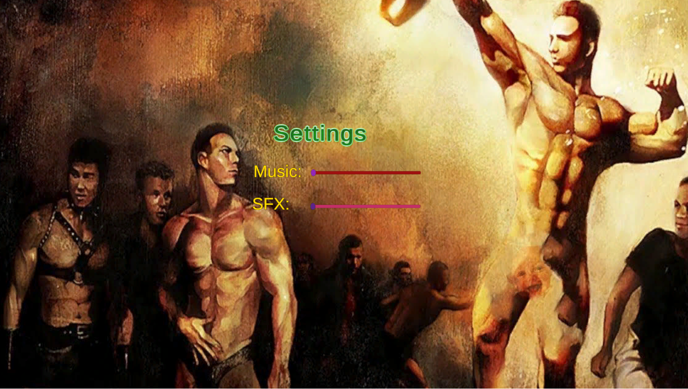
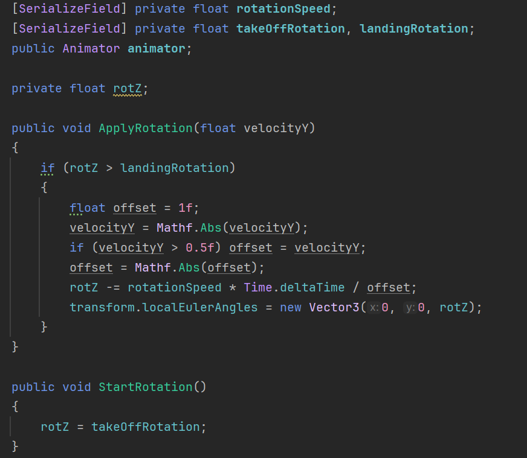
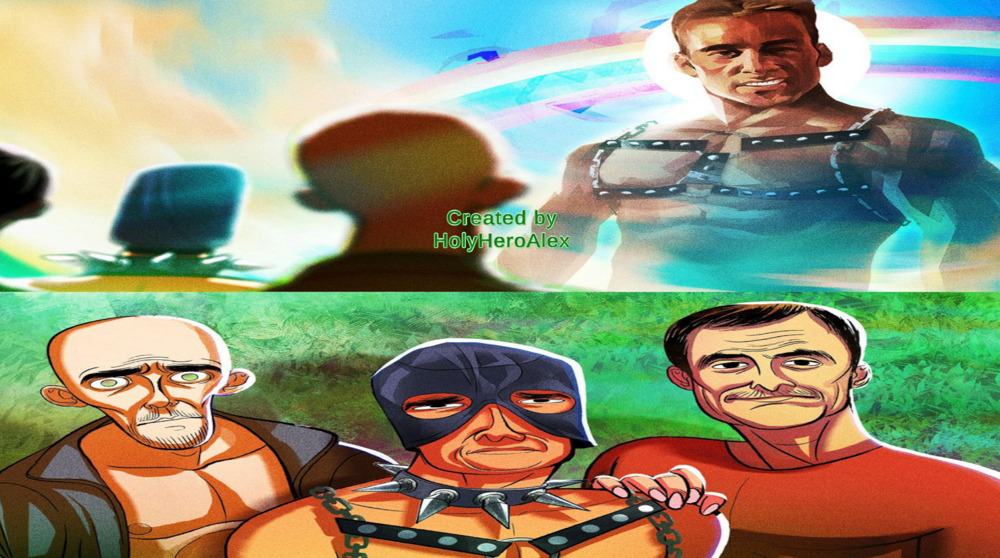
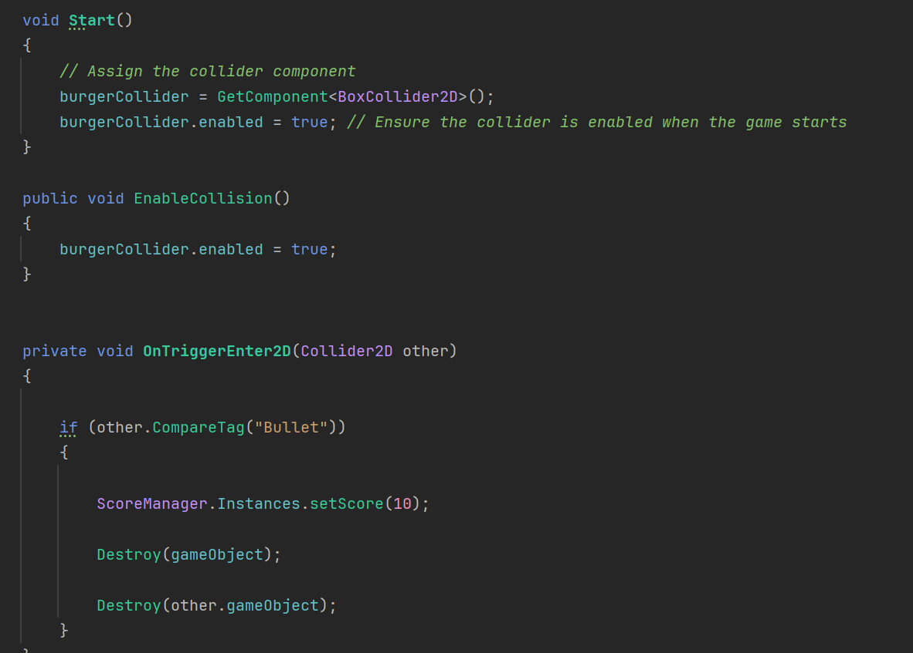
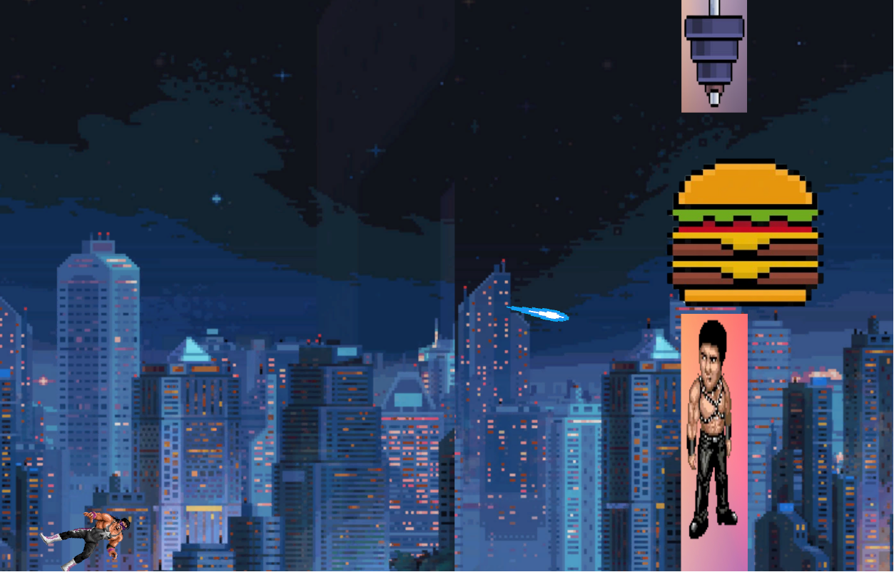

# Blog Post 5

## Introduction
In this blog post, I'll discuss the latest features and improvements added to my 2D game project. This update focuses on integrating sound effects, background music, new player animations, and additional gameplay mechanics.

## Feature Development

### Feature 1: Create Sound Effects

#### Implementation:
I added a script to manage all the sound effects (SFX) in the game. The sound effects, including a death sound and a jump sound in Gachimuchi style, were sourced from YouTube, edited, and then integrated into the game. I created a game object to handle the SFX script and referenced this in other scripts to trigger the respective sounds. For example, the death sound plays when the death menu appears, and the jump sound triggers whenever the player jumps.

### Feature 2: Create Background Music

#### Implementation:
The background music was implemented similarly to the SFX elements. However, in this case, the music persists throughout the game. I set the script to trigger the music when Scene 0 loads and ensured the music plays in a loop.

#### Bug:
The music did not play in Scene 0 as intended; instead, it started in Scene 1, and when Scene 1 was restarted, the music played twice.

#### Solution:
I added the music element to Scene 0 and attached it to a new game object. I updated the script to ensure that the music only interacts with Scene 0, preventing it from playing or doubling in Scene 1. Now, the music loads correctly in Scene 0.

### Feature 3: SFX and Music Control

#### Implementation:
I created a settings menu where players can control the volume of the SFX and background music. A new script was developed to manage these controls, allowing players to adjust the volume as needed.

#### Bug and Solution:
Initially, the script did not save the music and SFX settings correctly. After testing various methods, the issue was resolved, and the settings now persist as expected.

### Feature 4: New Player Animation

#### Implementation:
I added a new script to handle player animations. Now, when the player jumps, the character rotates to 40 degrees. When there is no input, the character gradually rotates down to 80 degrees from the previous position.

### Feature 5: Info Page

#### Implementation:
I updated the info page with a new background and added a button to return to the main menu. Additionally, I included a text element displaying the game's creator.

### Feature 6: Player Shoots the Burger

#### Implementation:
New objects were introduced to allow the player to shoot a burger. When the player presses a button, a bullet is fired. If the bullet hits the burger, the burger disappears, and the player earns extra points. If the player touches the burger, the death menu is triggered, and the scene stops.

#### Script:

#### UI in Game:

## Conclusion
This update has significantly enhanced the game's audio-visual experience and gameplay mechanics. The addition of sound effects, background music, new animations, and interactive elements like shooting has made the game more engaging. 

