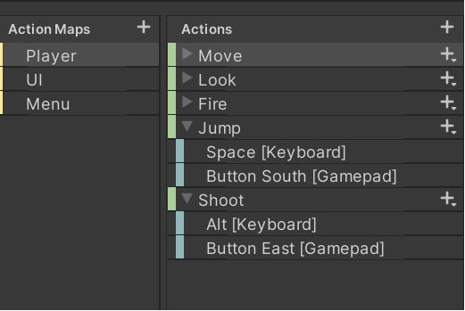

# User Guide

## Main Menu
When start the game in the main menu use the left stick controller to switch between buttons and for confirmation selection use south button.

## Settings scene
In the setting use the left stick controller to switch between sound bars and for lower and maximize the sounds, if want go back to main menu press east button.

## Info scene
Press east button to go to main menu.

## Game scene
Press south button to jump and east button to shoot

## Death menu
Use left stick to switch between buttons and for confirmation selection use south button.

## Game controls

